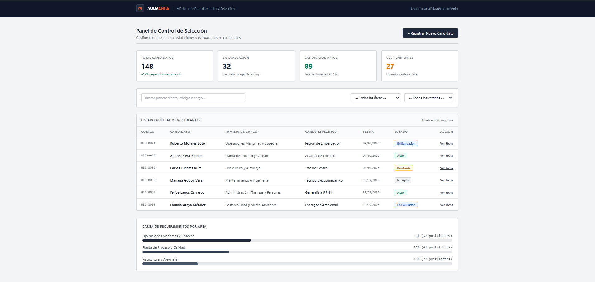
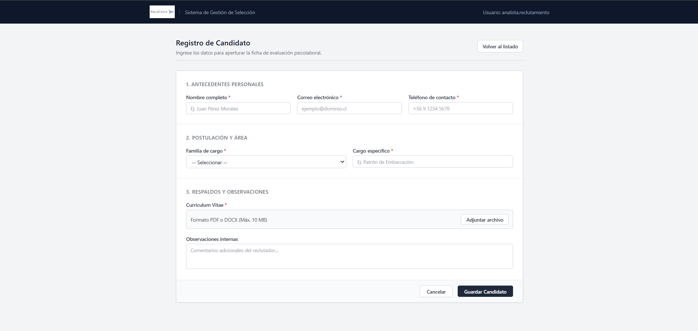

# AquaChile — Sistema de Gestión de Reclutamiento y Selección (ERP)

Un módulo web corporativo desarrollado para la gestión centralizada de procesos de selección de personal en **AquaChile**. El sistema adopta un enfoque visual de software empresarial tipo ERP/CRM: sobrio, profesional y enfocado en la eficiencia operativa de los analistas de recursos humanos.

---

## 👥 Quiénes Somos

Este proyecto fue desarrollado por:

* **[Anibal Toledo]** — *Desarrollo Frontend / UI*
* **[Benjamin Yovanovich]** — *Desarrollo Frontend / Lógica de Estado*
* **[Benjamin Sepulveda]** — *Base de datos*

---

## 🎯 ¿Qué hace el proyecto?

El sistema permite gestionar de forma ordenada y centralizada el flujo de ingreso y evaluación de candidatos para las distintas familias de cargo de AquaChile (Operaciones Marítimas, Planta de Proceso, Piscicultura, Mantenimiento, etc.).

### Funcionalidades Principales:

1. **Panel de Control (Dashboard ERP):**
   * **Tarjetas de KPIs:** Métricas en tiempo real sobre candidatos totales, en evaluación, aptos y revisiones pendientes.
   * **Búsqueda y Filtros:** Filtrado de postulantes por nombre, RUT, área operativa y estado del proceso.
   * **Tabla de Postulantes:** Registro estructurado con códigos únicos (`REG-XXXX`), fechas y etiquetas de estado.
   * **Distribución de Requerimientos:** Visualización del porcentaje de carga laboral según la familia de cargo.

2. **Formulario de Registro de Candidatos:**
   * Formulario modular con secciones claras para antecedentes personales, cargo y respaldos.
   * Validaciones de campos obligatorios y formato de correo electrónico en tiempo real.
   * Carga de archivos adjuntos para Curriculum Vitae (PDF/DOCX).

3. **Navegación SPA (Single Page Application):**
   * Transición fluida entre el Dashboard y el Formulario mediante estado local sin recargar la página.

---



---

## 🛠️ Tecnologías Utilizadas

* **[React](https://react.dev/)**: Librería para la construcción de interfaces basadas en componentes reutilizables.
* **[Tailwind CSS](https://tailwindcss.com/)**: Framework de utilidades CSS para un diseño responsivo, ligero y formal.
* **[Vite](https://vitejs.dev/)**: Entorno de desarrollo rápido y empaquetador de módulos.
* **JavaScript (ES6+)**: Lógica de renderizado condicional, manejo de estados (`useState`) y validaciones.

---

## 🚀 Instalación y Ejecución Local

Para ejecutar este proyecto en tu equipo local, sigue estos pasos:

1. **Clonar el repositorio:**
   ```bash
   git clone [https://github.com/tu-usuario/tu-repositorio.git](https://github.com/tu-usuario/tu-repositorio.git)
   cd aquachile-app
